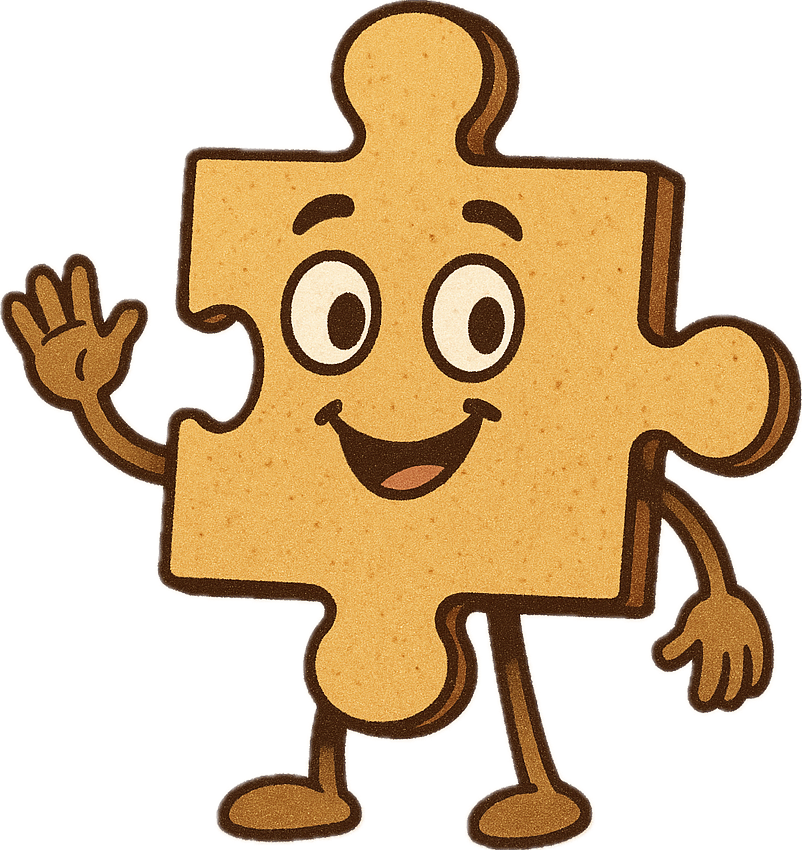

# 🧩 Visual Puzzles: Evaluating Vision-Language Model Reasoning with Rebus Puzzles

**🔥 Official repository for the project "Puzzled by Puzzles: When Vision-Language Models Can't Take a Hint"**

<div align="center">  
    
  
<br>
<p>
    <a href="https://huggingface.co/datasets/Kyunnilee/visual-puzzles">
      
    </a>
    &nbsp;
    <a href="https://arxiv.org/abs/2505.23759">
      
    </a>
    &nbsp;
    <a href="https://2025.emnlp.org">
      
    </a>
  </p>  
</div>

---

## Table of Contents
  - [Overview](#overview)
  - [Motivation](#motivation)
  - [Dataset](#dataset)
  - [Cognitive Skill Categories](#cognitive-skill-categories)
  - [Evaluation Metrics \& Scripts](#evaluation-metrics--scripts)
    - [1. **Naive Matching**](#1-naive-matching)
    - [2. **LLM-Judged Evaluation**](#2-llm-judged-evaluation)
    - [3. **CLIP/Image-Text Retrieval Metrics**](#3-clipimage-text-retrieval-metrics)
    - [4. **Skill-Specific and Prompting Evaluations**](#4-skill-specific-and-prompting-evaluations)
    - [5. **Bootstrapped Confidence Intervals**](#5-bootstrapped-confidence-intervals)
  - [Annotation Tools](#annotation-tools)
  - [How to Run](#how-to-run)
  - [Citing this work](#citing-this-work)
  - [Acknowledgements](#acknowledgements)

---

## Overview

This codebase supports the research and experiments from
[**"Puzzled by Puzzles: When Vision-Language Models Can't Take a Hint"**](https://arxiv.org/abs/2505.23759).

**Authors**: [Heekyung Lee](https://kyunnilee.github.io),[Jiaxin Ge](https://jiaxin.ge), [Tsung-Han Wu](https://tsunghan-wu.github.io/), [Minwoo Kang](https://joshuaminwookang.github.io), [Trevor Darrell](https://people.eecs.berkeley.edu/~trevor/), [David M. Chan](https://dchan.cc/) (POSTECH & UC Berkeley)

We introduce a **probe dataset of 432 hand-annotated English rebus puzzles**, each requiring integration of imagery, spatial arrangement, and symbolic reasoning-challenging VLMs far beyond rote image captioning or straightforward question answering.

---

## Motivation

Recent VLMs have excelled at direct visual-text alignment, but fundamental gaps remain in their ability to solve tasks requiring **abstract reasoning, compositional thinking, and cultural/phonetic inference**. Rebus puzzles-visual riddles encoding phrases or concepts through images, wordplay, and spatial logic-are a demanding testbed for these higher-order cognitive skills.

Our goal: **Systematically probe VLMs' capabilities and limitations** in visual-linguistic reasoning using a carefully curated and categorized benchmark, with human and model baselines for reference.

---

## Dataset

- **432 hand-crafted rebus puzzles** with curated images and answers
- Each puzzle is annotated with one or more of **11 cognitive skill categories** (see below)
- Images sourced and quality-checked for consistency
- Each puzzle includes:
  - Puzzle image
  - Ground truth answer
  - Skill category annotations

**Sample puzzle:**
If the word "WATER" is written in a curved downward shape, the answer is "Waterfall".

---

## Cognitive Skill Categories

Puzzles are annotated by required cognitive skill(s):

- **Absence or Negation (AN):** Recognizing missing or negated elements
- **Font Style/Size (FS):** Interpreting clues from font differences
- **Image Recognition (IR):** Identifying objects, symbols, or people
- **Letter and Word Manipulation (LWM):** Overlapping/hiding/repeating letters to form new meanings
- **Phonetics and Wordplay (PW):** Solving with homophones or puns
- **Quantitative/Mathematical Reasoning (QMR):** Object counting, math symbols, quantitative logic
- **Spatial and Positional Reasoning (SPR):** Understanding layout or relative positioning
- **Symbolic Substitution (SS):** Replacing with numbers, emojis, etc.
- **Text Orientation (TO):** Interpreting rotated/flipped text
- **Text Recognition (TR):** Detecting stylized text or fonts
- **Visual Metaphors & Cultural References (VMCR):** Idioms, memes, or metaphorical representations

See the paper Appendix D for detailed definitions and dataset statistics.

---

## Evaluation Metrics & Scripts

We provide multiple evaluation strategies and scripts:

### 1. **Naive Matching**
- **Script:** [`eval/eval_bootstrap.py`](eval/eval_bootstrap.py), [`eval/eval_human_files.py`](eval/eval_human_files.py)
- **Description:** Checks for exact (case-insensitive, space-insensitive) string match between model output and ground-truth answer.
- **Usage:** Set `LLM_AS_JUDGE = False` in the script or config.

### 2. **LLM-Judged Evaluation**
- **Script:** [`eval/eval_bootstrap.py`](eval/eval_bootstrap.py), [`eval/eval_human_files.py`](eval/eval_human_files.py)
- **Description:** Uses GPT-4o (or other LLM) to judge whether the model prediction is semantically equivalent to the ground truth, allowing for minor spelling/formatting errors.
- **Usage:** Set `LLM_AS_JUDGE = True` in the script or config.
  The LLM is prompted to respond with only "yes" or "no" for each prediction.

### 3. **CLIP/Image-Text Retrieval Metrics**
- **Script:** [`scripts/compute_clip_recall.py`](scripts/compute_clip_recall.py), [`scripts/summarize_clip_results.py`](scripts/summarize_clip_results.py)
- **Metrics:** Recall@K, Precision@1, MRR, NDCG, etc.
- **Description:** Evaluates retrieval performance using CLIP or similar models.
  Summarize results across multiple models with the summary script.

### 4. **Skill-Specific and Prompting Evaluations**
- **Configurable via:** YAML files in [`conf/`](conf/)
- **Description:** Evaluate performance by skill category, with in-context learning (ICL), skill-guided prompts, caption-only, or iterative refinement.

### 5. **Bootstrapped Confidence Intervals**
- **Script:** [`eval/eval_human_files.py`](eval/eval_human_files.py), [`eval/eval_bootstrap.py`](eval/eval_bootstrap.py)
- **Description:** Provides mean accuracy and 95% confidence intervals via bootstrapping.

---

## Annotation Tools

- **Ground Truth Annotation:**
  Use [`scripts/annotate_ground_truth.py`](scripts/annotate_ground_truth.py) (Gradio UI) to label answers for each puzzle image.

- **Skill Annotation:**
  Use [`scripts/annotate_skills.py`](scripts/annotate_skills.py) (Gradio UI) to assign cognitive skill categories to each puzzle.

---

## How to Run

1. **Configure your experiment:**
   - Edit YAML configs in the [`conf/`](conf/) directory to select models, prompts, and evaluation settings.

2. **Install dependencies:**
   ```bash
   pip3 install -r requirements.txt
   ```

3. **Run the evaluation script:**
   ```bash
   python3 main.py
   ```
   - For CLIP retrieval metrics, use:
     ```bash
     python3 scripts/compute_clip_recall.py --checkpoint ... --model ... --input_folder ... --ground_truth ... --output ...
     ```
   - To summarize CLIP results:
     ```bash
     python3 scripts/summarize_clip_results.py metrics/
     ```

4. **View results:**
   - Model predictions, logs, and evaluation metrics will be written to the specified output directory.
   - CLIP metrics will be saved as JSON files in the metrics directory.

---

## Citing this work
If you find this work useful, please cite our paper:

```bibtex
@inproceedings{lee2025puzzled,
              title        = {Puzzled by Puzzles: When Vision-Language Models Can’t Take a Hint},
              author       = {Heekyung Lee and Jiaxin Ge and Tsung-Han Wu and Minwoo Kang and Trevor Darrell and David M. Chan},
              year         = {2025},
              booktitle    = {Proceedings of the 2025 Conference on Empirical Methods in Natural Language Processing (EMNLP 2025)},
              url          = {https://arxiv.org/abs/2505.23759}
            }
```

## 🍀 Acknowledgements

Development supported in part by the National Science Foundation, the Ford Foundation, the BAIR Industrial Alliance, DARPA, and the U.S. Army/AFRL.
Special thanks to Lisa Dunlap, XuDong Wang, Konpat Preechakul, Baifeng Shi, and Stephanie Murphy for review and ideation support.
